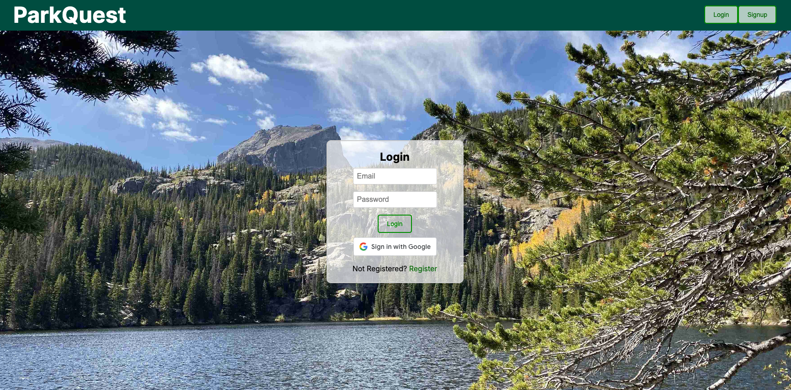
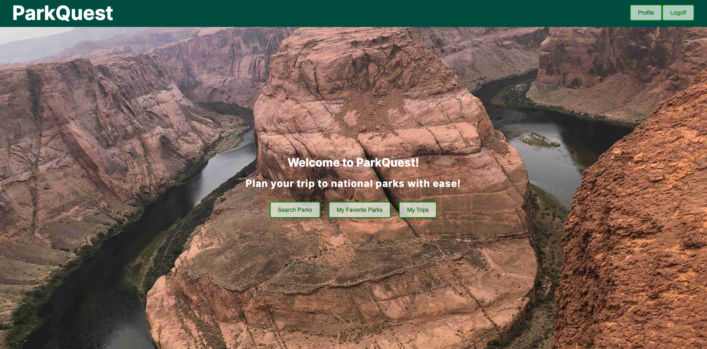
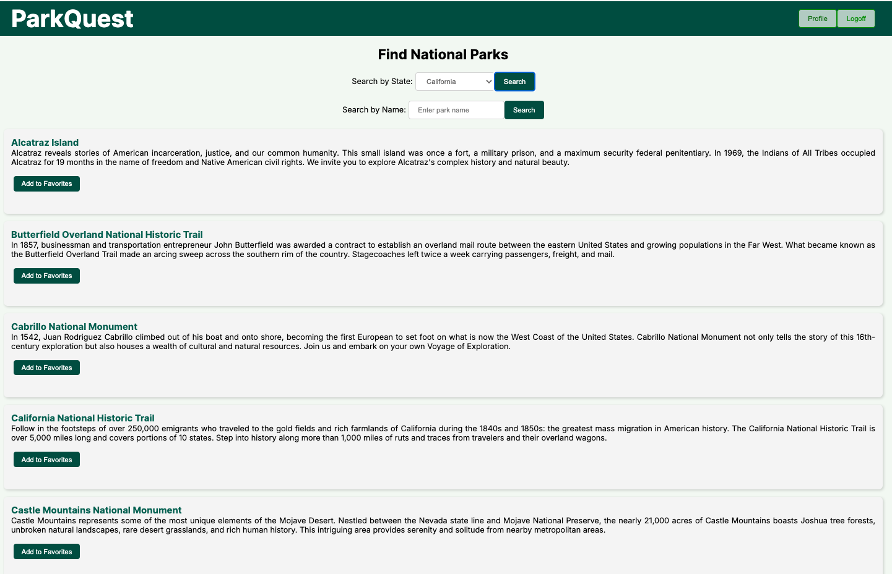
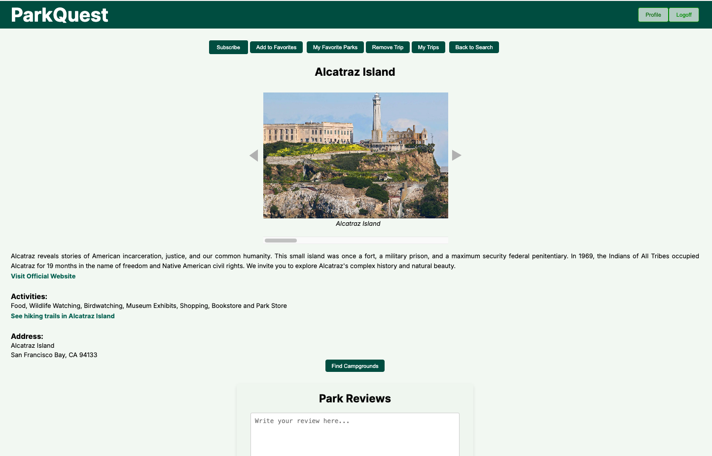
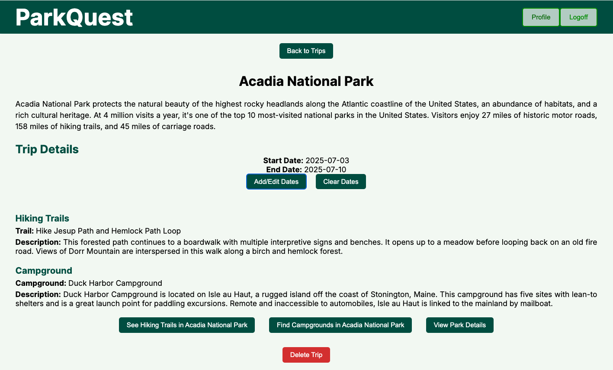

# ParkQuest

#### By Rachel Allen, Sara Bohannon, Sheetal Kharat, Tatiana Snook

## Description
ParkQuest is a user-friendly web application designed to help users explore and plan trips to national parks. It offers intuitive tools for browsing park details, discovering available activities, viewing campground options, saving favorite parks, tracking trips, writing and managing reviews, and more—making outdoor adventure planning seamless and enjoyable.

## Features

### User Features:
1. **User Authentication**
   - Sign up and log in with input validation for email, password, and other details.
   - Secure token-based authentication.
   - Role-based access for users (Admin/User).

2. **Dashboard**
   - Personalized dashboard with quick links to search parks, favorites, trips, and the admin panel (for admin users).

3. **Search Parks**
   - Search parks by their **name** or **state**.
   - View detailed park information such as images, descriptions, activities, and addresses.

4. **Park Details**
   - View detailed information about a specific park, including:
     - Images (with carousel navigation).
     - Description of available activities.
     - Address and website links.
     - Links to explore **hiking trails** and **campgrounds** within the park.
     - Favorite a park for quick access later.
     - Subscribe for updates on specific parks.

5. **Campgrounds**
   - View a list of campgrounds within a park.
   - Explore detailed information about specific campgrounds, including:
     - Images, descriptions, nearby attractions, amenities, and reservation info.
   - View campground reservation links.

6. **Hiking Trails**
   - Explore hiking trails within a park.
   - View trail details such as descriptions, difficulty levels, and durations.

7. **Favorite Parks**
   - Save parks as favorites for easy access later.
   - Remove parks from favorites.
   - Add and update personal notes for each favorite park.

8. **Trip Management**
   - Create, view, and manage trips.
   - Add parks, campgrounds, and hiking trails to trips.
   - Update trip details such as start and end dates.
   - Delete trips when no longer needed.

9. **Park Reviews**
   - View and submit reviews for parks.
   - Ratings are displayed (1-5 stars).
   - Edit or delete reviews as needed.
   - Admins can manage and moderate all reviews.

### Admin Features:
1. **Admin Panel**
   - View all users registered in the system.
   - Change user roles (toggle between Admin/User).
   - Delete user accounts (cannot delete own account).
   - Manage reviews and other critical roles.

2. **User Management**
   - Access a table of all registered users with options to edit roles or remove accounts.

### Notifications:
- Toast notifications for actions like adding favorites, submitting reviews, handling errors, and more.

### Responsive Design:
- The application is designed to work across different devices (desktop, tablet, and mobile).

---

## Technologies Used

### Backend:
- **Java**
- **Spring Boot**
- **National Park Service API**: Provides access to parks and campground data.

### Frontend:
- **React** with hooks.
- **Vite**: A fast development and build tool.
- **CSS**: For styling.
- **Axios**: For HTTP requests.
- **react-router-dom**: For client-side routing.
- **chart.js**: Renders temperature charts in trips.
- **react-icons**: Adds intuitive icons to the UI.
- **react-hot-toast**: Displays notifications.

---

## Screenshots

### Login Page


### Home Page


### Parks Search Page


### Park Detail Page


### Trip Detail Page


---

## Setup & Installation

### Database Configuration (MySQL)
1. **Create Database Schema**
   ```sql
   CREATE DATABASE park_quest;
   CREATE USER 'your_user_name'@'localhost' IDENTIFIED BY 'your_password';
   GRANT ALL PRIVILEGES ON park_quest.* TO 'your_user_name'@'localhost';
   FLUSH PRIVILEGES;
   ```

2. **Update Backend Configuration**  
   Edit the `application.properties` file in `src/main/resources`:
   ```properties
   spring.datasource.url=jdbc:mysql://localhost:3306/park_quest
   spring.datasource.username=your_user_name
   spring.datasource.password=your_password
   spring.jpa.database=MYSQL
   spring.jpa.show-sql=true
   spring.jpa.hibernate.ddl-auto=update
   spring.jpa.properties.hibernate.dialect=org.hibernate.dialect.MySQL8Dialect
   spring.application.name=parkquest-backend
   server.port=8081
   ```

3. **Add Environment Variables**  
   Set up the National Park Service API key in `application.properties`:
   ```properties
   api.key=your_national_parks_service_api_key
   ```

### Backend Installation
1. **Clone the repository**
   ```bash
   git clone https://github.com/W-PTWD-April-2024-Liftoff/group-9
   cd parkquest-backend
   ```

2. **Install dependencies**
   Use Gradle:
   ```bash
   ./gradlew build
   ```

3. **Run the Backend**
   Start the Spring Boot application:
   - Open `ParkquestBackendApplication.java` in your IDE and run the main method.
   - The backend will run at `http://localhost:8081`.

---

### Frontend Installation
1. **Navigate to Frontend Directory**
   ```bash
   cd parkquest-frontend
   ```

2. **Install Dependencies**
   ```bash
   npm install
   ```

3. **Add Environment Variables**  
   Create a `.env` file in the root of the `frontend` project:
   ```env
   VITE_PARKS_API_KEY=your_national_parks_service_api_key
   ```

4. **Run the Frontend**
   ```bash
   npm run dev
   ```
   The application will run at `http://localhost:5173`.

---

## Deployment
**Backend**: Host the backend using services like Heroku or AWS. Make sure the database credentials and API key are securely configured.  
**Frontend**: Deploy the React app using platforms like Netlify, Vercel, or Firebase Hosting.

---

## Known Issues
- No known issues at this time.

---

## Acknowledgements
- **National Park Service API**: Provides access to parks and campground data.
- **LaunchCode Web Development Program** (April 2024 Cohort) for structured learning.
